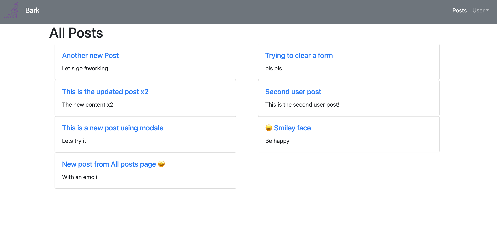

# Bark Social Application

Bark is a social media application which allows users to write posts on any topics they would like, while also being able to see the posts of others. Within those posts users have the possibility of writing comments on the posts to express their opinions or provide feedback.
The purpose of this app is to try and incorporate the different aspects of a social media application while being able to learn the necessities of a social media app and how to build them.

## Planning Journey

The development of the bark application started on the idea of creating an app that could serve multiple purposes and that people would be able to use to their own liking. Based on that idea, I decided that creating a social media application with the fundamental functionalities would help me build my skills both in the back end and the front end of the app.
It is easy to get lost on deciding what kind of functionalities someone wants to integrate into their application, therefore it was necessary to decide what the key ones were and then to build upon them. The two key functionalities that would be the basis of the application were posts and comments.
To avoid any particular errors that could significantly impact the application I used Github's version control system, and I built the front-end and the back-end in a series of versions.
Whenever an Issue occured I would take that opportunity to learn about the possibilities of how I could resolve by using different resources.
creating and learning about social media applications in order to recreate one.

## Important Links

- [Back-end repository](https://github.com/guyfredw/bark-api)
- [Deployed Client](https://guyfredw.github.io/bark-react/)
- [Deployed API](https://bark-api-project.herokuapp.com)

### Technologies Used

- JavaScript
- React
- HTML
- CSS
- React-Bootstrap
- Axios
- Git
- GitHub
- Node

### Future Features or Unsolved Problems

- Styling
- Likes
- Tags
- Follower system
- Notification system

### User stories

- As an unregistered user, I would like to sign up with email and password.
- As a registered user, I would like to sign in with email and password.
- As a signed in user, I would like to change password.
- As a signed in user, I would like to sign out.
- As a signed in user, I would like to add my post to my feed.
- As a signed in user, I would like to update my post on my feed .
- As a signed in user, I would like to delete my post on my wall.
- As a signed in user, I would like to see all my posts.
- As a signed in user, I would like see all the posts including mine and the others.

### App Screenshot

### Wireframes

### Set up instructions

1. Fork and clone this repository
2. Install dependencies with `npm install`.
3. Git add and git commit your changes.
4. Run the development server with `npm start`.
